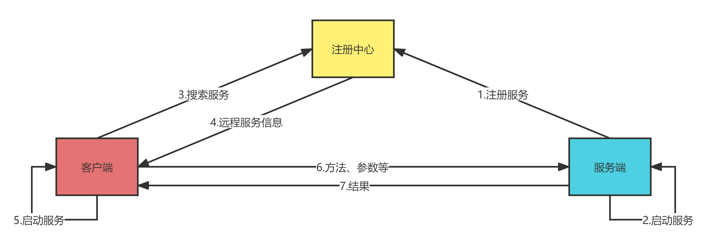
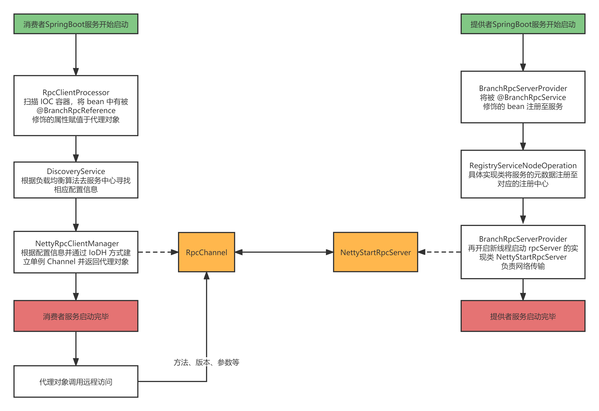

# BranchRpc

## 简单介绍

是一框基于 `Spring`和 `Netty`的`RPC`框架

目前支持轮询、随机负载均衡算法

目前支持同步和异步调用远程服务

目前只支持 `Zookeeper` 作为注册和配置中心，定制了 `SPI`，如果需要可以进行扩展

目前支持 `Google Gson` 和 `JDK` 序列化算法

通过 `Netty` 代替 `BIO`方式进行网络传输

自定义私有协议代替 HTTP 协议

## 开发思路

`RPC` 最重要的就是客户端、服务端、注册中心三大组件

这三个组件交互顺序如下：

- 一、启动服务端，也就是咱们在使用`Dubbo`时加了 `@DubboService`的服务，在启动时，可以通过 `Spring` 的 `BeanPostProcessor` 对所有加了咱们自定义的暴露服务注解，比如笔者用的是 `@BranchRpcService`，进行注册至注册中心
  - 考虑点一、如何注册服务
  - 考虑点二、如何启动服务
- 二、启动客户端，也就是咱们在使用 `Dubbo` 时加了 `@DubboReference`的服务，在启动时，要为其赋一个实现了接口的实例，而这个实例的方法最终调用的是远程服务的方法，可以通过 `Spring` 的 `BeanFactoryPostProcessor`对所有加了咱们自定义的注入服务注解，比如笔者用的是 `@BranchRpcReference`，进行一个代理实例绑定
  - 考虑点一、如何搜索服务
  - 考虑点二、如何实现代理
- 三、搜索到服务后，就可以通过注册中心的服务节点得到远程服务对象的 `Class`信息，从而进行反射得到一个代理实例，调用方法时通过将方法、参数等数据转化为网络字节流传达到远程服务对象，服务端收到对应信息后调用相应对象的方法得到结果，再将结果转化为网络字节流传达到客户端
  - 考虑点一、如何网络传输



## 使用说明

### 定义服务接口

*参见 test-provider-api*

```java
package org.branchframework.rpc.test.service;

/**
 * @author Haixin Wu
 * @since 1.0
 */
public interface HelloService {
    String sayHello(String name) throws InterruptedException;
	//如果要使用异步方式，返回类型要注明为 Object
    Object sayHello1(String name) throws InterruptedException;
}
```

### 服务端

*参见 test-provider*

#### 具体实现

```java
package org.branchframework.rpc.test.provider.service.impl;

import org.branchframework.rpc.server.annotation.BranchRpcService;
import org.branchframework.rpc.test.service.HelloService;


import java.util.concurrent.TimeUnit;

/**
 * @author Haixin Wu
 * @since 1.0
 */
@BranchRpcService(interfaceType = HelloService.class)
public class HelloServiceImpl implements HelloService {
    @Override
    public String sayHello(String name) throws InterruptedException {
        TimeUnit.SECONDS.sleep(1);
        return "9092，您好，" + name;
    }

    @Override
    public Object sayHello1(String name) throws InterruptedException {
        TimeUnit.SECONDS.sleep(1);
        return "9092，您好，" + name;
    }
}
```

#### 启动类

```java
package org.branchframework.rpc.test.provider;

import org.springframework.boot.SpringApplication;
import org.springframework.boot.autoconfigure.SpringBootApplication;
import org.springframework.context.annotation.ComponentScan;

/**
 * @author Haixin Wu
 * @since 1.0
 */
@SpringBootApplication
@ComponentScan("org.branchframework.rpc")
public class ProviderApplication {
    public static void main(String[] args) {
        SpringApplication.run(ProviderApplication.class, args);
    }
}
```

#### 相关依赖

```xml
    <dependencies>
        <dependency>
            <groupId>org.springframework.boot</groupId>
            <artifactId>spring-boot-starter-web</artifactId>
            <version>2.5.2</version>
        </dependency>
        <dependency>
            <groupId>org.branchframework.rpc</groupId>
            <artifactId>branch-rpc-server</artifactId>
            <version>1.0</version>
        </dependency>
        <dependency>
            <groupId>org.branchframework.rpc.test</groupId>
            <artifactId>test-provider-api</artifactId>
            <version>1.0-SNAPSHOT</version>
        </dependency>
    </dependencies>
```

#### 相关配置

```properties
server.port=9092
branch.rpc.server.port = 9992
branch.rpc.server.appName = test
branch.rpc.server.registryAddress = 127.0.0.1:2181
```

### 客户端

*参见 test-consumer*

#### 具体引用

```java
package org.branchframework.rpc.test.consumer.controller;

import io.netty.util.concurrent.Future;
import org.branchframework.rpc.client.annotation.BranchRpcReference;
import org.branchframework.rpc.core.balancer.LoadBalance;
import org.branchframework.rpc.test.service.HelloService;
import org.springframework.web.bind.annotation.*;

import java.util.concurrent.TimeUnit;

/**
 * @author Haixin Wu
 * @since 1.0
 */
@RestController
@RequestMapping("/test")
@CrossOrigin
public class HelloController {

    @BranchRpcReference(version = "1.0", sync = true, loadBalance = LoadBalance.RoundRobin)
    private HelloService helloService;

    @BranchRpcReference(version = "1.0", sync = false, loadBalance = LoadBalance.RoundRobin)
    private HelloService helloService1;

    @BranchRpcReference(version = "1.0", sync = true, loadBalance = LoadBalance.Random)
    private HelloService helloService2;

    @GetMapping("/sync/hello/{name}")
    public String syncHello(@PathVariable String name) throws InterruptedException {
        return helloService.sayHello(name);
    }

    @GetMapping("/sync/hello1/{name}")
    public String syncHello1(@PathVariable String name) throws InterruptedException {
        return helloService2.sayHello(name);
    }

    @GetMapping("/async/hello/{name}/{waitTime}")
    public String asyncHello(@PathVariable String name, @PathVariable Integer waitTime) throws InterruptedException {
        Future<String> future = (Future<String>) helloService1.sayHello1(name);
        TimeUnit.MILLISECONDS.sleep(waitTime);
        return future.getNow();
    }

}
```

#### 启动类

```java
package org.branchframework.rpc.test.consumer;

import org.springframework.boot.SpringApplication;
import org.springframework.boot.autoconfigure.SpringBootApplication;

/**
 * @author Haixin Wu
 * @since 1.0
 */
@SpringBootApplication
public class ConsumerApplication {
    public static void main(String[] args) {
        SpringApplication.run(ConsumerApplication.class, args);
    }
}
```

#### 相关依赖

```xml
    <dependencies>
        <dependency>
            <groupId>org.springframework.boot</groupId>
            <artifactId>spring-boot-starter-web</artifactId>
            <version>2.5.2</version>
        </dependency>
        <dependency>
            <groupId>org.branchframework.rpc</groupId>
            <artifactId>branch-rpc-client</artifactId>
            <version>1.0</version>
        </dependency>
        <dependency>
            <groupId>org.branchframework.rpc.test</groupId>
            <artifactId>test-provider-api</artifactId>
            <version>1.0-SNAPSHOT</version>
        </dependency>
    </dependencies>
```

#### 相关配置

```properties
server.port=9090
branch.rpc.client.registry = zookeeper
branch.rpc.client.registryAddress = 127.0.0.1:2181
branch.rpc.client.serialization = Gson
branch.rpc.client.timeout = 10
```

### 网络传输

#### 自定义协议

| 参数     | 魔数 | 协议版本 | 序列化号 | 请求类型 | 请求序号 | 数据长度 | 对齐填充 | 数据内容 |
| -------- | ---- | -------- | -------- | -------- | -------- | -------- | -------- | -------- |
| 占用Byte | 4    | 1        | 1        | 1        | 4        | 4        | 1        | ？       |

#### 动态代理

基于`JDK`接口的动态代理

具体实现是在`NettyRpcClientManager`的 `setTarget`方法中的如下代码：

```java
Object o = Proxy.newProxyInstance(classLoader, interfaces, invocationHandler);
return (T) o;
```

原理是消费者服务启动时会有个 `RpcClientProcessor` `bean`的后置处理器，会扫描 `IOC` 容器中的 `bean`，如果发现这个 `bean`的属性加了 `@BranchRpcReference`修饰，就会给属性动态赋值一个代理对象

#### 注册中心

注册中心的节点：`RegistryServiceNode`

对注册中心的节点操作接口：`RegistryServiceNodeOperation`

基于`Zookeeper`对注册中心的节点操作接口实现类：`ZkRegistryServiceNodeOpImpl`

而`ZkRegistryServiceNodeOpImpl`是基于 `curator-framework` 的 `ServiceDiscovery<T>`进行注册、注销等操作

如果需要添加新的注册中心时可以通过实现 `RegistryServiceNodeOperation`进行拓展

#### 服务注册

目前是只支持 `Zookeeper`，服务启动时 `BranchRpcServerProvider` 会获取到被 `@BranchRpcService`修饰的 `bean`，从而再使用 `RegistryServiceNodeOperation`接口的实现类将信息注册到注册中心中

#### 服务搜索

对注册中心的节点搜索接口：`DiscoveryService`

基于`Zookeeper` 对注册中心的节点搜索接口实现类：`ZkDiscoveryServiceImpl`

而 `ZkDiscoveryServiceImpl` 同样是基于  `curator-framework` 的 `ServiceDiscovery<T>`进行搜索操作

#### 负载均衡算法

负载均衡算法接口：`LoadBalance`

轮询实现类：`RoundRobinLoadBalance`

在使用时会通过服务端的配置进行选择，默认选择轮询负载均衡算法

#### 序列化算法

典型策略模式，通过序列化环境维护一个抽象策略类的引用

抽象序列化器：`Serializer`

具体序列化器：`XxxSerializer`

序列化环境：`SerializationContext`

#### 具体流程



### 接口调用

#### 调用方式

##### 同步

浏览器输入

```
localhost:9090/test/synchello/world
```

结果


##### 异步

**情况一**

浏览器输入

```
http://localhost:9090/test/async/hello/world/999
```


未出现结果的原因是服务端需要等待`1000ms`才能返回结果，而客户端限制了`999ms`，所以主线程提前结束返回空

**情况二**

浏览器输入

```
http://localhost:9090/test/async/hello/world/1500
```


客户端主线程等待 `1500ms` 足够服务端返回结果和网络传输

#### 负载均衡

在 `@BranchRpcReference` 注解中添加属性 `loadBalnce = 具体的负载均衡算法` 默认情况是是轮询算法

**具体案例读者可以通过上述服务端和客户端的代码展示**

## 开发环境

操作系统：Windows

开发工具：IDEA

项目技术栈：SpringBoot 2.5.2 + JDK 1.8 + Netty 4.1.72.Final

项目管理工具：Maven 4.0.0

项目代码管理工具：Git

注册中心：Zookeeper 3.5.4

序列化算法引用：Google Gson 2.9.0